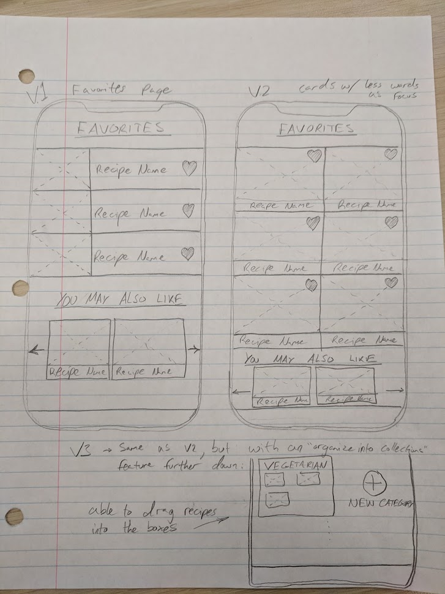
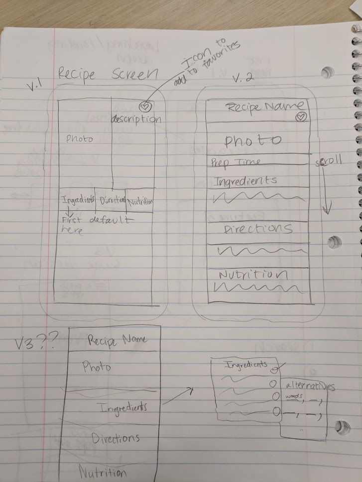
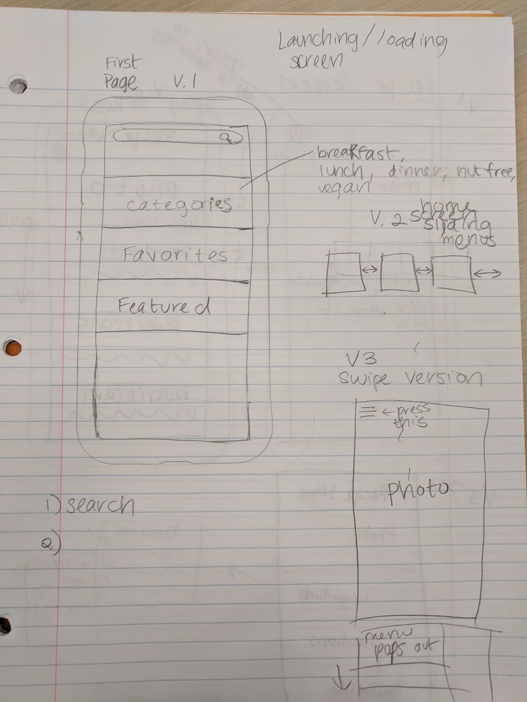
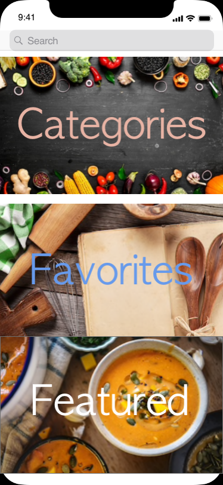
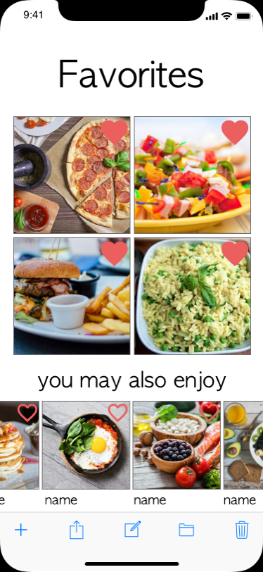
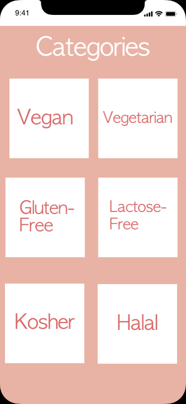
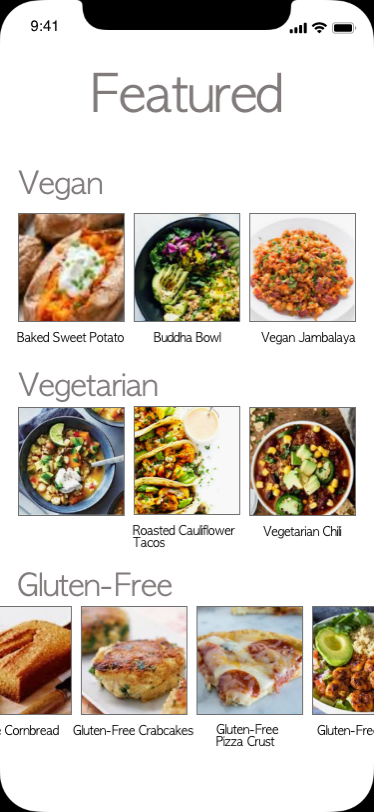
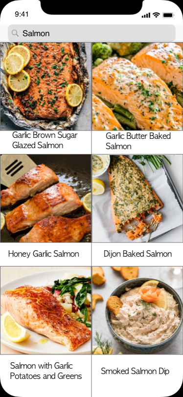
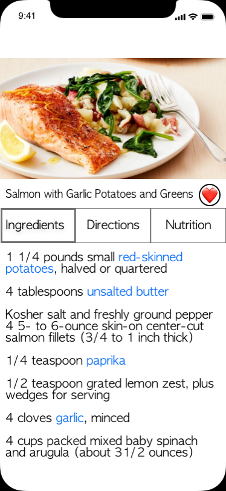
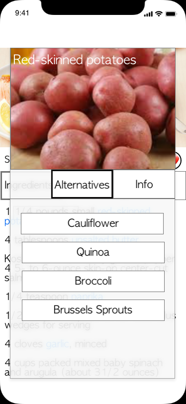

# Milestone 1

## Objectives
  * Who are the users?
    * Anyone who cooks, does grocery shopping 
  * Why is the problem important?
    * Sometimes there are areas that don't carry a certain ingredient for a certain dish ie. no localized ingredients readily available 
      * Healthier alternative to ingredients for food
      * Food allergy substitution (nuts, shellfish, fruits) 
      * Dietary needs substitution (lactose intolerant, gluten free) 
  * What solutions currently exist?
    * You can manually google specific alternatives for ingredients, there are substitution apps but either cost money or doesn’t specifically offer healthier alternatives
  * What is the problem trying to be solved?
    * Problem, no centralized, comprehensive outlet for data, you might have to navigate through several web pages to put together a dish, spend money on an app or DL several apps to find out what you need. 
  * Inherent problems
    * High maintenance due to the nature of the website, new recipes 
    * Substitutions for certain ingredients could fail for certain dishes 
    * Substitutions can be somewhat subjective.
      * Potential solution: allow community suggestions/voting.
## Task 
  * Potential users? Not targeted user? Why? 
    * Cooks, people with dietary restrictions, people who do not have ready access to exotic/specialized ingredients.
    * Not targeting those we are not sensitive to ingredient choice.
  * What task do they seek to perform?
    * Find alternatives to ingredients in a recipe
  * Functionality of the system? What will the solution do, why is it needed?
    * Allow user to quickly find an alternative to an ingredient in a recipe
    * Filter by diet restrictions
    * Suggest where to buy ingredients.
  * Criteria to decide success or failure of system?
    * User rating of quality of suggestion
    * Professional ratings on quality of suggestions
    * Pageviews
  * Task environment:
    * The kitchen, grocery store, at the computer
    * Most likely mobile device.
    * Problem most likely to affect people in developed nations.
    * Age range likely 18+; anyone who goes shopping for groceries.
    * Wealthier more likely to use platform; more able to purchase alternatives that may be more expensive.

# Milestone 2
* Pages (defined as team):
  * Main menu / home
    * Search functionality
      * Filter by: text (name), food type (veg, protein, etc), dietary restrictions (allergies), diet type (vegan)
      * Design option: simple text search
      * Design option: middleground of the two
    * Category browser
    * Favorites
    * Featured recipes/ingredients
  * Favorites / saved - tab for ingredients, tab for recipes
  * Results of search
  * Categories browser
    1. Dropdown
    2. Independent, new page
        * Show Spotify-like cards to choose from, showing different diets, restrictions, bfast, lunch, brunch, dinner, dessert, drinks
  * Individual ingredient
    * Alternative options
    * Nutritional info, food type (icon, other), diet type
    * Order or find at store, show price
  * Individual recipe
    * Ingredients involved (expandable for more info on each?), nutritional info, photos, instructions, cook/prep time, utensils
    * Alternative options
    * Order or find at store, show price (all ingredients at once, select those you don’t need)
  * Featured (curated) list
* Sketches of each (3 per page)
* Mockups of each (1 per page)
* Storyboard of typical user flows
* Walkthrough narrative
* Design justification where needed, pros/cons
* Describe design process
* Poster
  * Group name
  * Show all 3 design alternatives (sketches, mocks, sbs)

## Design Process

To ensure a smooth design process, we first spent some time listing out each necessary view in the app (shown above), thought carefully about the implications of adding features, and planned out how we’d create each design.
Starting the actual drawing with a storyboard (described later) would allow us to see how complex we were making things and was a good place to trim unnecessary clutter. After deciding on the key features we wanted our app to have, we moved on to creating sketches for each view. Each view needed three unique sketches that showed variation in design choices -- these choices are described later in the report. Finally, after choosing the best sketch of each view in the app, we created a single software mockup for each view, allowing us to more accurately visualize what the first iteration of the app will look like.

## Storyboard

We decided to visualize the three main user flows in the application, defined as:
1. Searching for a recipe you already have in mind and replacing an ingredient,
2. Browsing the recipe finder to replace an ingredient, 
3. And going back to recipes saved as favorites in the past to replace an ingredient

## Sketches


## Mockups

The mockups below are of the design that the group felt made the most sense for the user. We wanted something more intuitive and easier to use. We need to add a toolbar towards the bottom for each screen and a back button as well. We will also need to increase the font size of the descriptions underneath each photo of the results page as to show that the dishes are different despite them having similar photos. Walking through the app, the homepage will have categories, favorites and featured where categories will list out all dietary restrictions plus other categories we will add later like entrees and desserts. The favorites when pressed from the homepage, will take you to all the recipes that the user has favorited. Featured will have a curated list of dishes put together by the team. The search bar at the top will allow the user to type in a type of food such as salmon as shown in our mockup below and will display all items containing this food. If you press the thumbnail, you’ll be taken to a larger display of the recipe as shown in the 6th screen. The highlighted blue text will be hyperlinks that you can press that will display a modal pop up that provides ingredient alternatives to that food along with other information in a separate tab.
 

